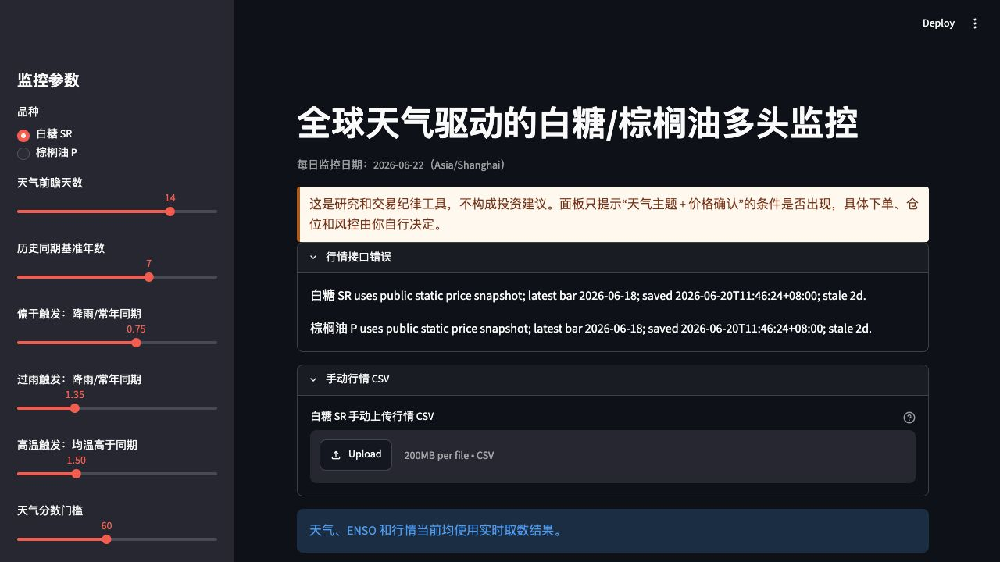
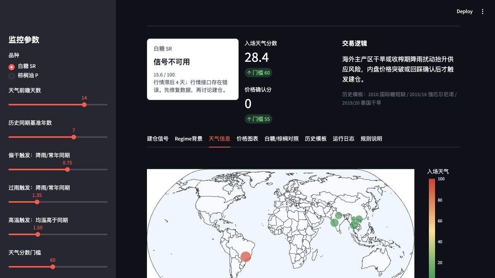
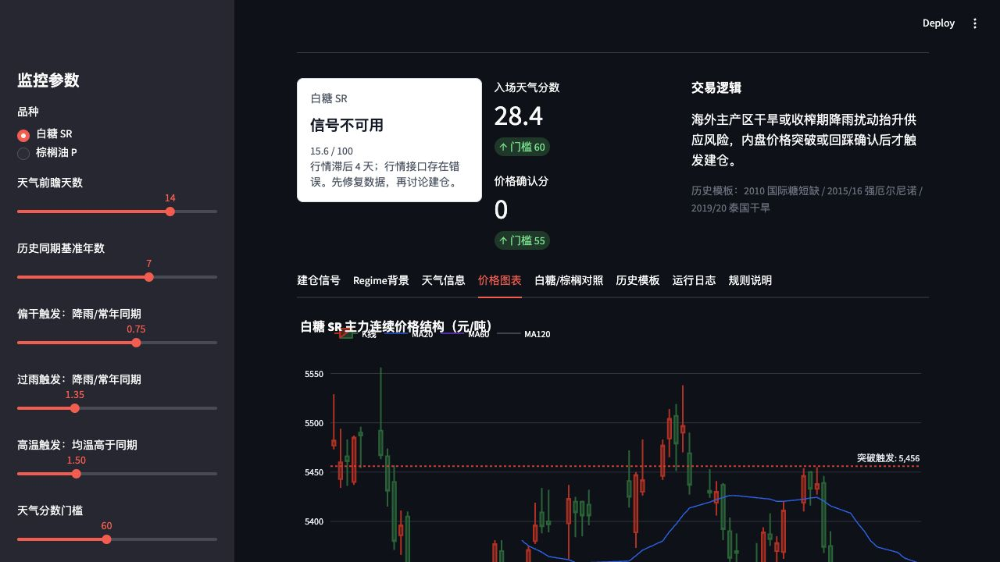

# 全球天气驱动的白糖/棕榈油多头监控面板

一个用 Streamlit 构建的商品天气交易研究面板，用来跟踪全球主产区天气、ENSO 背景、价格趋势确认和仓位风险预算，判断白糖 `SR0` 与棕榈油 `P0` 是否出现“天气主题 + 价格确认”的多头观察条件。

这个项目适合作为个人页面或作品集中的数据产品案例：它把外部天气数据、期货行情、规则化信号、风控参数和可视化仪表盘组合成一个可每日复盘的交易纪律工具。

## 界面展示

### 监控参数与数据源状态



### 全球主产区天气分布



### 价格确认与技术位



## 功能亮点

- 多品种监控：覆盖白糖 `SR0` 和棕榈油 `P0`，分别配置主产区、权重、合约乘数、保证金率和历史天气案例。
- 天气压力评分：按主产区权重聚合未来 7-16 天降雨、最高温、水分差，并与历史同期基准比较。
- Regime 背景：跟踪 NOAA CPC ONI/ENSO 状态和关键生产季窗口，辅助判断天气主题的宏观背景。
- 价格确认：用 MA20/MA60/MA120、20 日突破、成交量和持仓量扩张过滤单纯天气噪音。
- 风控输出：根据账户权益、单笔风险、保证金上限、试仓比例和止损距离，生成试仓手数、止损价、加仓确认价和移动止损参考。
- 数据回退：无 iFinD 凭据时自动使用 `public_data/price` 静态行情快照，适合公开部署和作品集展示。

## 信号逻辑

面板不会只因为天气异常就提示建仓，而是分三层判断：

1. 天气分数：主产区天气是否偏干、过雨或高温，并按产区权重汇总。
2. 价格确认分：收盘价是否站上关键均线、是否突破前高，以及量仓是否配合。
3. 综合建仓提示：天气和价格同时达标时才进入试仓讨论，并受交易时段、合约流动性和组合风险闸门约束。

默认纪律：

- 天气分数达标、价格未达标：等待突破或回踩确认。
- 价格分数达标、天气未达标：按普通趋势处理，不强行归因于天气主题。
- 天气和价格同时达标：只提示试仓，默认 20%-30% 计划风险仓位。
- 跌破 60 日均线、价格闸门失效或天气分数明显回落：降低或取消天气主题仓位。

## 技术栈

- UI 与交互：Streamlit
- 数据处理：pandas、numpy
- 图表可视化：Plotly
- 天气数据：Open-Meteo Forecast API、Open-Meteo Historical Weather API
- Regime 数据：NOAA CPC ONI
- 行情数据：AKShare、iFinD，或仓库内静态快照

## 快速运行

macOS / Linux:

```bash
python -m venv .venv
.venv/bin/python -m pip install -r requirements.txt
APP_PRICE_SOURCE=static .venv/bin/python -m streamlit run app.py
```

Windows PowerShell:

```powershell
python -m venv .venv
.\.venv\Scripts\python -m pip install -r requirements.txt
$env:APP_PRICE_SOURCE="static"
.\.venv\Scripts\python -m streamlit run app.py
```

本地有 iFinD 凭据时，可以在 `.streamlit/secrets.toml` 或环境变量中配置：

```toml
IFIND_REFRESH_TOKEN = "..."
IFIND_USERNAME = "..."
IFIND_PASSWORD = "..."
```

也可以通过环境变量覆盖行情模式：

```bash
APP_PRICE_SOURCE=static   # 使用 public_data/price 静态快照
APP_PRICE_SOURCE=ifind    # 强制使用 iFinD
APP_PRICE_SOURCE=akshare  # 强制使用 AKShare
```

## 数据源与部署模式

- 本地研究模式：优先使用 iFinD 实时行情；无 iFinD 凭据时可回退到 AKShare 或手动上传 CSV。
- 公开展示模式：使用 `APP_PRICE_SOURCE=static`，读取 `public_data/price/*.csv` 和 `*.json`，避免在公开页面暴露行情凭据。
- 刷新流程：本地收盘后运行应用并更新行情快照，再提交 `public_data/price` 下的快照文件。

手动上传 CSV 至少需要包含 `date/open/high/low/close` 字段，也支持中文字段 `日期/开盘价/最高价/最低价/收盘价`。

## 项目结构

```text
.
├── app.py                         # Streamlit 主应用
├── requirements.txt               # Python 依赖
├── public_data/price/             # 公开展示用静态行情快照
├── docs/screenshots/              # README 展示截图
└── TODO.md                        # 后续优化记录
```

## 风险说明

这个工具是研究与交易纪律面板，不构成投资建议。期货带杠杆，必须自行设置单笔风险、止损、总仓位上限和交易权限约束。
